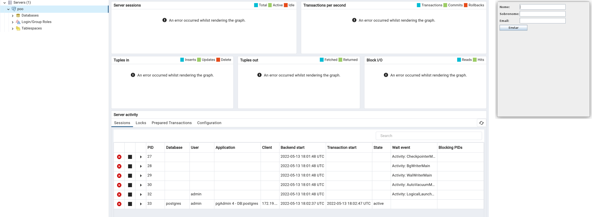

<p align="center">
  
</p>

## 🚀 Tecnologias

Esse projeto foi desenvolvido com as seguintes tecnologias:

- [PostgreSQL](https://www.postgresql.org/)
- [Java](https://www.java.com/pt-BR/)
- [Docker](https://www.docker.com/)

## 💻 Projeto

Esse projeto foi desenvolvido para avaliação de prova da faculdade, pertecente a matéria Programação Orientada a Objetos II, o projeto tem como objetivo criar um servido Docker com PostgreSQL e com o Java fazer a conexão no banco de dados, além de também alterar dados e inserir.

## :gear: Instruções
---
## Ambiente

### Instalar o docker na máquina
```
https://docs.docker.com/engine/install/
```
### Update Server/Host

```
sudo apt upgrade -y
```
```
docker info
```
```
docker ps -a
```
### Parando os Containers
```
docker image ls -a
```
```
docker rm -f (id do container)
```
```
docker image rm -f (id da image)
```

### Ambiente docker para Banco de Dados

```
docker run --name some-postgres -e POSTGRES_PASSWORD=mysecretpassword -d -p 5433:5432 postgres

```
### Acessar o Bash do Container
```
docker exec -it some-postgres bash
```
### Logar no Postgres
```
psql -U postgres
```

### Criar BD (POO)
```
createdb poo
```
### Listar BD
```
poo \l
